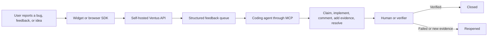

# Ventus In-App Feedback

Developer-friendly in-app feedback capture and an agent-ready workflow for
turning user reports into shipped improvements. Users can submit bug reports,
general feedback, and feature ideas without leaving the application. Ventus
adds the application context and optional diagnostics, stores each report as a
structured work item, and exposes a controlled workflow for coding agents and
human reviewers.

The integration packages are open source. The self-hosted backend is
source-available under the Business Source License. The project is currently
pre-release.

## How it works



1. A user opens the feedback widget inside your application and chooses `bug`,
   `feedback`, or `idea`.
2. The browser integration combines the user's description with safe application
   context and the diagnostics they chose to share.
3. The self-hosted API validates and stores the report, attachments, workflow
   state, and append-only audit events.
4. A coding agent searches the queue through the MCP server, claims a report,
   and uses its existing repository tools to investigate and implement the
   change.
5. The agent can leave progress comments, attach implementation evidence, and
   mark the report resolved. A separately authorized human or verification agent
   closes it after verification, or reopens it when more work is needed.

Ventus is the feedback and work-coordination layer. It does not give an agent
access to your application repository or deploy changes by itself. The agent
must already run in an environment with the appropriate source-control, test,
and deployment access.

## Structured reports instead of unstructured messages

Every report has a stable ID and a schema-versioned record, so agents do not
have to infer the state of a task from a chat transcript.

| Area                 | Structured data                                                                                                         |
| -------------------- | ----------------------------------------------------------------------------------------------------------------------- |
| User report          | Category, title, description, and attachments                                                                           |
| Application context  | Workspace, project, source application, release, environment, URL, labels, and sanitized host context                   |
| Optional diagnostics | JavaScript errors, failed requests, recent actions, console output, browser metadata, performance data, and screenshots |
| Triage               | Status, priority, labels, assignee claim, and version                                                                   |
| Collaboration        | Comments, evidence, external links, and append-only audit events                                                        |
| Outcome              | Resolution reason, summary, commit/PR/issue/deployment links, and verification state                                    |

The browser SDK uses bounded diagnostic buffers, default redaction, and
screenshot masking. Most diagnostic collection is opt-in. Applications can
also provide custom redaction and masking rules before data leaves the browser.

## Add feedback to an application

The framework-neutral Web Component is the quickest integration:

```ts
import { defineVentusFeedbackWidget } from "@ventus/feedback-widget";

defineVentusFeedbackWidget();
```

```html
<ventus-feedback
  endpoint="/v1/feedback"
  project-key="public-ingestion-key"
  source-app="storefront"
  release="2026.08.02"
  environment="production"
  theme="auto"
></ventus-feedback>
```

The widget gives users one place to describe a bug, share feedback, or propose
a feature. It can include a screenshot or file and lets the reporter control
which optional diagnostics are submitted. A thin React wrapper is available for
React applications.

Use `@ventus/feedback-browser` directly when you want a custom interface or a
headless capture flow. It provides the same redaction, diagnostic collection,
payload validation, and transport primitives without imposing a UI framework.

Project keys are submit-only credentials and can be restricted by allowed
origins. Never expose an agent or service token in browser code.

See the [widget guide](packages/widget/README.md),
[browser SDK guide](packages/browser/README.md), and
[React wrapper guide](packages/react/README.md) for package-level examples.

## Connect a coding agent

The MCP server exposes the feedback workflow to any MCP-compatible agent while
keeping the HTTP API as the canonical business interface.

```bash
export VENTUS_FEEDBACK_API_URL=http://localhost:8080/v1
export VENTUS_FEEDBACK_API_TOKEN=replace-with-an-agent-token
npx @ventus/feedback-mcp
```

The token should normally have `feedback:read`, `feedback:triage`,
`feedback:comment`, and `feedback:resolve`. Reserve `feedback:close` for an
independent human or verification agent when you want separation between the
implementer and the verifier.

### Recommended agent workflow

1. Call `search_feedback` to find work by status, category, priority, label,
   claimant, release, environment, or free-text search.
2. Call `get_feedback` immediately before acting to retrieve the complete report
   and its current version.
3. Use `update_feedback` to record triage decisions such as priority, status, or
   labels.
4. Call `claim_feedback` before implementation. A claim is an expiring lease,
   which prevents two agents from silently working on the same task forever.
5. For longer work, call `renew_feedback_claim`. Use
   `release_feedback_claim` when stopping or handing the task to someone else.
6. Investigate and implement the change with the agent's normal repository
   tools. Use `comment_feedback` for progress, questions, or a concise handoff.
7. Call `add_feedback_evidence` with relevant test results, reproduction notes,
   screenshots, or deployment proof.
8. Call `resolve_feedback` with a resolution reason, summary, and optional
   commit, pull request, issue, or deployment links.
9. After independent verification, call `close_feedback`. If verification fails
   or the reporter supplies new evidence, call `reopen_feedback` and return it to
   the queue.
10. Use `reject_feedback` for explicit non-fixed outcomes such as a duplicate,
    an irrelevant report, or a deliberate decision not to implement it. Call
    `list_feedback_events` whenever the complete audit trail is needed.

The available statuses are `new`, `triaged`, `in_progress`, `resolved`,
`closed`, `rejected`, and `reopened`. Resolution reasons distinguish `fixed`,
`already_done`, `wont_do`, `duplicate`, and `not_relevant` rather than reducing
every outcome to “done.”

An example instruction for an implementation agent is:

> Search for high-priority open bug reports affecting the current production
> release. Claim one report, inspect its diagnostics and history, reproduce the
> problem, and implement and test the fix in the application repository. Leave
> progress comments when useful, attach the commit and test evidence, and resolve
> the report. Do not close it; closure belongs to the verifier.

See the [MCP server guide](apps/mcp-server/README.md) for installation,
configuration, and the complete tool contract.

## Workflow guarantees

- Every mutation uses optimistic versioning. Agents send the version they read;
  a stale update conflicts instead of overwriting newer work.
- Mutations use idempotency keys, so a network retry can safely replay the exact
  request. Changed input must use a new key.
- Claims expire. An interrupted agent cannot hold a report indefinitely.
- Resolution and closure are separate actions, allowing independent verification.
- Comments, state transitions, claims, and evidence produce audit events.
- Tenant and project boundaries are enforced by the API, not by agent prompts.
- Anonymous reporters can receive a report-scoped follow-up token without being
  granted access to the rest of the feedback queue.

## Workspace

- `packages/browser` — framework-neutral browser capture core.
- `packages/widget` — framework-neutral Web Component feedback UI.
- `packages/react` — thin React wrapper around the Web Component.
- `packages/contracts` — domain model, state machine, and OpenAPI 3.1 contract.
- `packages/api-client` — typed framework-neutral client for the `/v1` API.
- `apps/api` — self-hosted Fastify/PostgreSQL API with an in-memory test adapter.
- `apps/mcp-server` — stdio MCP adapter backed exclusively by the typed HTTP client.
- `apps/demo` — local dogfooding playground using the public packages.
- `PLANNING.md` — comprehensive productization and release plan.

## Local development

Requirements: Node.js 22.13 or newer for the complete workspace.

```bash
npm install
npm run demo
```

To dogfood the complete browser-to-agent flow on conflict-free local ports,
start the complete stack with one command:

```bash
docker compose up --build
```

Open `http://localhost:3100`. Submissions from the capture form and fixed widget
are stored by the API at `http://localhost:8180` and return a stable feedback ID
that an MCP agent can immediately search for and claim. The stack also exposes
PostgreSQL on `15433`, the MinIO API on `19001`, and the MinIO console on
`19002`. Copy `.env.example` to `.env` only when you want to override these
defaults.

Run the complete foundation checks with:

```bash
npm run verify
```

`verify` runs strict type-checking, all tests, repository-wide ESLint, a
non-mutating Prettier check, package-tarball inspection, and the dependency
audit. Use `npm run format` to apply the repository style before rerunning it.

Start the complete local backend on ports 8080, 15432, 19000, and 9001:

```bash
docker compose up --build
```

Then run `node scripts/smoke-api.mjs` with the environment values documented in
the [API guide](apps/api/README.md) to exercise create, upload/download, claim,
resolve, close, audit events, competing claims, and transactional mutation
replay. CI also runs `scripts/smoke-retention.mjs` against PostgreSQL and MinIO
to prove dry-run, soft-delete, object removal, content scrubbing, and audit
pseudonymization.

Production requirements, upgrades, backups, scaling, and key rotation are
covered in [the deployment guide](docs/deployment.md). The
[security threat model](docs/security-threat-model.md) records the current
threat model and known pre-stable gaps.

## Licensing

The browser SDK, widget, React wrapper, contracts, API client, and MCP adapter
are licensed under MIT. The self-hosted API in `apps/api` is licensed under the
Business Source License 1.1 (BUSL-1.1).

The API's Additional Use Grant permits development and non-production use, plus
production use until the API processes more than 1,000 aggregate feedback
submissions per calendar month for three consecutive months. A 30-day transition
window follows the third month. Production use outside that grant requires a
commercial license from Ventus Software Solutions GmbH. Each API version changes
to Apache-2.0 on the fourth anniversary of its first public distribution.

See [`LICENSE`](LICENSE) for the component map and the controlling license
files. The BSL-licensed API is source-available, not open source before its
Change Date. The licensing parameters and commercial agreement should receive
legal review before the first public release.
